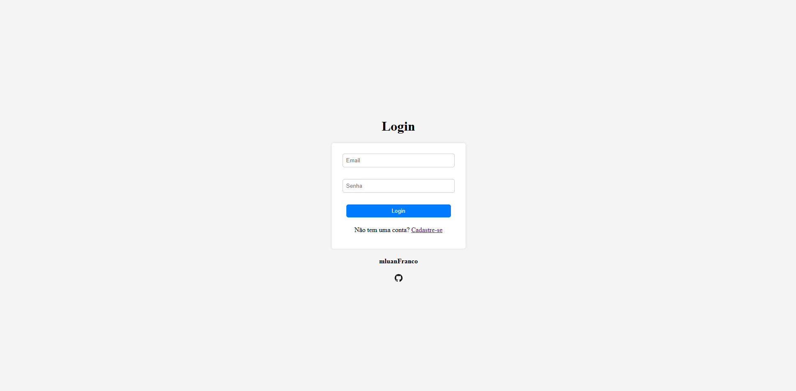
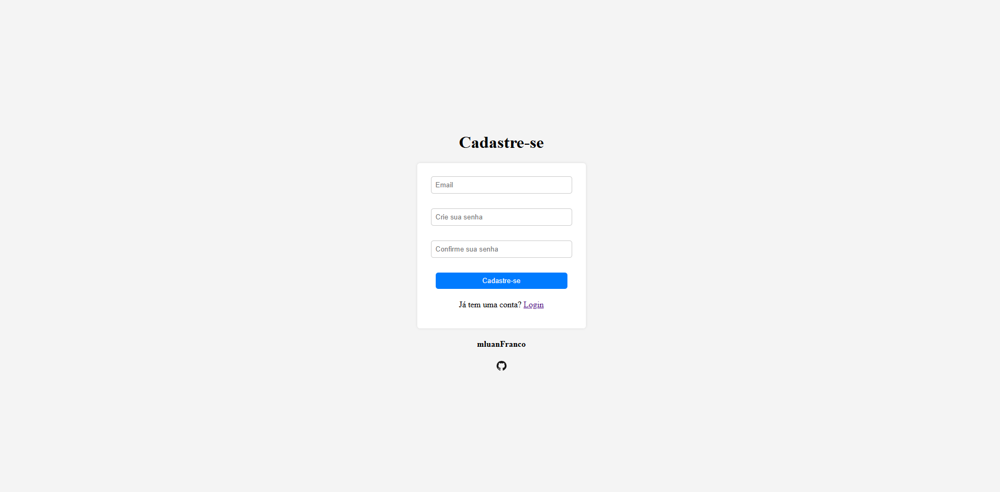

# Página de Login e Cadastro de Usuários  

## 📌 Sobre o Projeto  
Este projeto tem como objetivo praticar habilidades de desenvolvimento web usando **HTML e CSS**.  

O objetivo é criar uma página de **Login e Cadastro**, onde os usuários podem se registrar e acessar uma plataforma específica e seus recursos.  

## 🛠️ Tecnologias Utilizadas  
- HTML  
- CSS  

## 🚀 Funcionalidades  
✅ Registro de usuários
✅ Página de Login

## Dê uma Olhada 👀  
  
  
