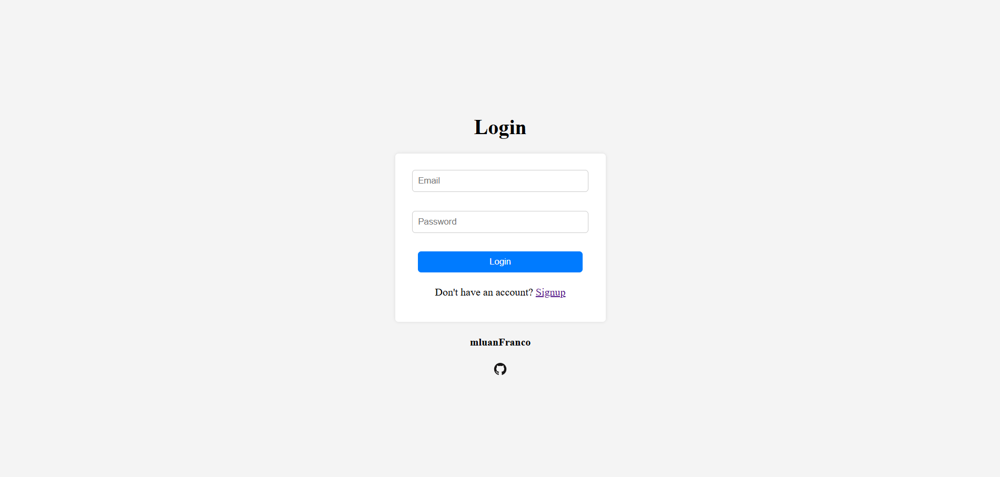

# Client Register Page

## 📌 About the Project
This project aims to practice web development skills using **HTML, CSS, and JavaScript**.

The goal is to create a **Login and Signup** page where users can register and acess a specific platform and its features.

## 🛠️ Technologies Used
- HTML
- CSS
- JavaScript

## 🚀 Features
✅ User registration
✅ Login Page
✅ Responsive Design

## Take a Look 👀

